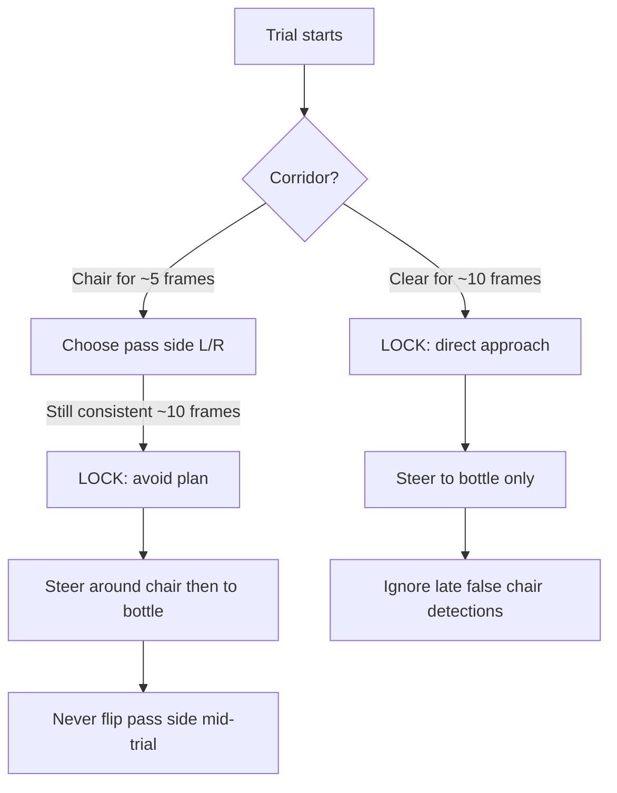

# Belt Obstacle Detection & Avoidance

**Purpose of this document:** Briefing notes for presenting the belt approach + chair-avoidance work to a supervisor / professor.  
**Scope:** feelSpace naviBelt guidance while walking toward a bottle; optional static chair in the path.  
**Code:** `hans_android/server/feedback_devices/adapters/belt_adapter.py` (branch `feat/belt_obstacle_avoidance`)

---

## 1. What problem does this solve?

Blind / low-vision users are guided toward a target bottle using **waist vibration** on a feelSpace naviBelt.

Two experimental conditions use **one shared codebase**:

| Condition | Scene | What the belt does |
|-----------|--------|--------------------|
| **Clear path** | Bottle only | Steer directly to the bottle |
| **Obstacle** | Bottle + **one static chair** between user and bottle | Guide around the chair, then resume approach to the bottle |

**Experiment assumptions (important):**
- The only obstacle is a **chair**.
- The chair **does not move** during a trial.
- The bottle stays fixed.
- No other obstacle types are expected.

At close range (~50 cm), the belt stops and hands off to a bracelet for grasping (separate work).

---

## 2. High-level system role

```text
Phone (ARCore depth + YOLO bottle)
        │
        ▼
   Server / BeltAdapter
        │
        ├── Clear corridor  → vibrate toward bottle
        └── Chair in corridor → vibrate toward side waypoint → then bottle
        │
        ▼
   feelSpace naviBelt (16 motors around the waist)
```

- **Detection of the bottle:** YOLO (object detection) + depth for distance.
- **Detection of the chair:** **not** YOLO. The chair is found from the **depth map** in a forward “corridor” region of the image.
- **Steering cue:** one vibration direction around the waist (bearing) + intensity related to distance.

---

## 3. How chair detection works

### 3.1 Forward corridor (region of interest)

Each frame, the system looks only at a **narrow vertical strip** in front of the user:

- Horizontally: centered on the image (~±10% of width; wider once avoidance has started).
- Vertically: mid-band of the image (~22%–55% of height).

**Why this band?**
- Captures a typical **chair seat / back** in the walking view.
- **Excludes the floor** (lower band), which would otherwise look like a “close obstacle” in depth.
- Ignores the sky / far background.

```text
  ┌─────────────────────────────┐
  │         (upper FOV)         │
  │      ┌───────────────┐      │
  │      │  CORRIDOR ROI │ ← mid-height strip
  │      │  (chair band) │
  │      └───────────────┘      │
  │         (floor band)        │  ← intentionally ignored
  └─────────────────────────────┘
```

### 3.2 Depth test (is there a chair?)

Inside the corridor, depth pixels are classified as “chair-like” if they are:

1. **Valid** depth (not missing / absurd).
2. **Not** part of the bottle bounding box (so the target itself is not treated as an obstacle).
3. **Closer than the bottle** by a margin (default ≥ 40 cm in front of the target), and not farther than ~2 m.

If a large enough **fraction** of valid corridor pixels are “closer than the bottle,” the corridor is marked **blocked**.

From those closer pixels the system estimates:
- **Obstacle center (image x)** — where the chair sits left–right.
- **Obstacle depth** — median depth of those pixels.

If the fraction is too small → corridor is **clear** (no chair for navigation purposes).

### 3.3 Robustness against depth noise

ARCore depth can flicker. To avoid false avoidance on an empty path:

- The chair must appear for **several consecutive frames** (~5) before avoidance steering starts (`OBSTACLE_CONFIRM_FRAMES`).
- A one-frame glitch does **not** pull the user sideways.
- Floor clutter alone does not trigger avoidance (wrong image band).

---

## 4. Plan freeze (static scene)

Because the chair and bottle **do not move**, the system does **not** replan every frame.

After ~10 consistent frames (`PLAN_LOCK_FRAMES`), it **locks** one of two plans:



| Locked mode | Meaning |
|-------------|---------|
| **`direct`** | No chair in plan. Always steer to bottle. Late depth noise cannot switch to avoidance. |
| **`avoid`** | Chair confirmed. Pass side + chair geometry frozen. Walk the plan until corridor clears, then resume bottle. |

**Why lock?** Without locking, frame-to-frame depth jitter can flip “go left / go right” and confuse the user. For a **fixed chair**, locking is the correct model.

---

## 5. What happens when a chair is present (two phases)

### Phase A — Pass the chair

1. Confirm chair over consecutive frames.
2. Choose **pass side**:
   - Prefer the side toward the bottle (shortest path around the chair).
   - If the bottle is almost directly behind the chair, pick the side with more free space in the corridor.
3. Compute a **side waypoint**: an image column ~20 cm past the chair on the chosen side (using assumed camera FOV).
4. Belt vibrates toward that waypoint (not toward the bottle yet).

### Phase B — Resume the bottle

1. Keep checking the corridor.
2. When the corridor stays clear for a sustained window (~30 frames), treat the chair as **passed**.
3. Switch steering back to the **bottle**.
4. Continue normal approach until handoff distance.

```text
User ──► [chair] ──► bottle

Phase A: vibrate toward side of chair
Phase B: vibrate toward bottle
Close:   belt stops → bracelet grasp (~50 cm)
```

---

## 6. Clear-path behavior (same code, no chair)

When there is no chair:

1. Steer to the bottle with a **smoothed** bearing (reduces jitter from detection).
2. After stability, lock **`direct`**.
3. Intensity increases as the user gets closer.
4. At ~80 cm: pre-handoff cue (navel pulses).
5. At ≤50 cm: handoff cue; belt stops.

This is the same adapter used for obstacle trials — only the locked plan differs.

---

## 7. Navigation cues (belt events)

| Cue | When | Rough pattern |
|-----|------|----------------|
| Start | Approach begins | 3 navel pulses |
| Direction change | Coarse left/center/right flip | Short all-around pulse (rate-limited) |
| Continuous | While walking | Smooth vibration toward steer direction |
| Pre-handoff | ~80 cm from bottle | 4 navel pulses |
| Handoff | ≤50 cm | All-around pulse; belt stops |

Avoidance does **not** use a special “obstacle alert” pattern; the user feels the **change of steering direction** toward the side waypoint.

---

## 8. Design choices to emphasize in the talk

1. **Depth corridor, not chair class labels** — works for the thesis chair without depending on YOLO “chair” detection.
2. **One static chair** — plan freeze is intentional, not a missing feature.
3. **One codebase for both conditions** — clear-path and chair trials share logic; confirmation + direct lock prevent false avoidance.
4. **Belt = walk; bracelet = grasp** — obstacle work sits only in the approach phase.
5. **User stays oriented** — continuous directional vibration + discrete cues; no visual dependence.

---

## 9. What this system does *not* do

- Does not track a **moving** chair or replan around a relocated obstacle mid-trial.
- Does not handle **multiple** obstacles or other obstacle types (tables, people, etc.).
- Does not classify “chair” with YOLO; it detects a **closer depth mass** in the corridor.
- Does not navigate after handoff (bracelet takes over).

---

## 10. Suggested slide outline (10–12 min)

1. Goal: belt approach to bottle; optional static chair  
2. Dual conditions, one codebase  
3. Pipeline: depth + YOLO → BeltAdapter → naviBelt  
4. Corridor ROI (diagram)  
5. Depth rule: closer-than-bottle fraction  
6. Confirmation + plan lock (why static chair matters)  
7. Phase A / Phase B walk-through  
8. Clear-path case (same code)  
9. Cues + handoff to bracelet  
10. Limitations & next steps (optional)

---

## 11. Key parameters (reference)

| Parameter | Typical value | Role |
|-----------|---------------|------|
| Corridor half-width | ~10% of image | Forward walking path |
| Corridor vertical band | ~22%–55% height | Chair seat/back; skip floor |
| Closer-than-target margin | 0.40 m | Chair must be in front of bottle |
| Enter fraction | 0.22 | How filled corridor must be to call “blocked” |
| Confirm frames | 5 | Noise rejection before avoidance |
| Plan lock frames | 10 | Freeze direct vs avoid |
| Clear frames to exit | 30 | Sustained clear → resume bottle |
| Safe margin past chair | 0.20 m | Side waypoint offset |
| Handoff enter | 50 cm | Belt → bracelet |

---

## 12. One-sentence summary

> We guide the user to a bottle with waist vibration; if a **single static chair** blocks the forward depth corridor, we lock a pass-side plan, steer around it, then resume bottle approach — and the same code stays on a direct approach when the corridor is clear.
